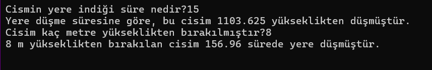
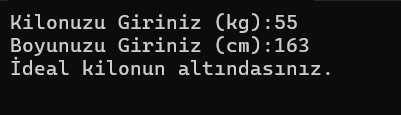
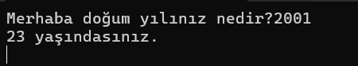
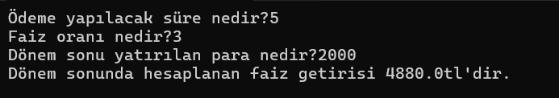

# Konsol Uygulaması
## Beyza ÜNSAL

<h3>1.Proje</h3>

Ana menüden çalıştırmak istediğiniz uygulamayı seçiniz.
<h4>1.Hesap Makinesi</h4>

Hesap makinesinden yapmak istediğiniz işlemi seçiniz.
<h4>2.Müzik Türleri Hakkında Bilgi</h4>

Bilgi almak istediğiniz müzik türünü seçerek istenen tür hakkında bilgi edinebilirsiniz.

<h5>3.Not Ortalaması</h5>

Hesaplamak istediğiniz dersten aldığınız birinci, ikinci ve performans notlarını girerek not ortalamanızı hesaplayabilirsiniz.
<h6>4.Dairenin Çap ve Alan Hesabı</h6>

Hesaplamak istediğiniz dairenin çapını girerek çevresini ve alanını hesaplayabilirsiniz.

<h7>5.Bilmece Oyunu</h7>

Sorulara düşündüğünüz cevabı verdiğiniz taktirde doğru cevabı söyler, yeni soruyu karşınıza getirir.
<h8>6.Cismin Düşme Süresi</h8

Cismin düşme süresine göre veya bırakıldığı yüksekliğe göre düşme hızını hesaplar.

<h9>7.Boy Kilo Endeksi</h9

Kilonuzu kg cinsinden ve  boyunuzu cm cinsinden sırasıyla girerek endeksinizi hesaplayabilirsiniz.(bki<= 20 ise İdeal kilonun altındasınız, 20< bki <= 25 ise Kilonuz ideal, 25< bki <= 30 ise İdeal kilonun üstündesiniz, 30> ise İdeal kilonuzun çok üstündesiniz.)

<h10>8.Yaş Hesabı</h10>

Doğum yılınıza göre şuan kaç yaşında olduğunuzu hesaplar.
<h9>9.Faiz Getirisi Hesaplama</h9

Yatıracağınız paranın dönem sonundaki getirisini faiz ve süreye göre hesaplar.

<h11>10.Ritmik Sayma</h11
