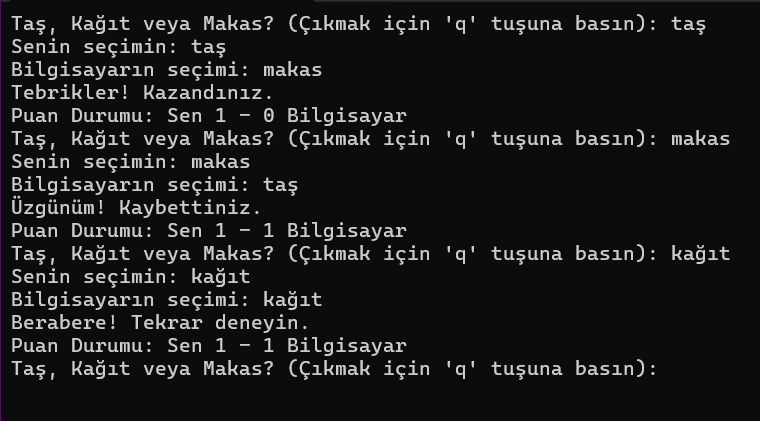

# Konsol Uygulaması
## Beyza ÜNSAL

<h3>Konsol Uygulaması Proje Tanıtımı</h3>
Ana menüde yer alan seçeneklerden yapmak istediğiniz uygulamayı seçerek konsolu çalıştırabilirsiniz. Örneğin, ana menüden hesap makinesini seçmek için 1 numaralı seçeneği işaretleyin. Ardından, yapmak istediğiniz işlemi ve gerekli sayıları girin; Bu adımları takip ederek, istediğiniz sonuca kolayca ulaşabilirsiniz. Aynı şekilde diğer seçenekler için de istenilen bilgileri girdiğiniz taktirde hedefinize kolayca ulaşabilirsiniz.
Video anlatım için tıklayınız. <a href="https://drive.google.com/" title= "https://drive.google.com/drive/folders/1tt5N2mgZD2uvavvWZUVeOdo9UpqKcYaz?usp=sharing"</a>

<h3>Vektörel 1.Proje Ana Menü</h3>

Ana menüden çalıştırmak istediğiniz uygulamayı seçiniz.

<td><h4>1.Hesap Makinesi</h4></td>

Hesap makinesinde yapmak istediğiniz işlemi seçin ve istenilen bilgileri doğru şekilde girin.

<b><h4>2.Müzik Türleri Hakkında Bilgi</h4></b>

Bilgi almak istediğiniz müzik türünü seçerek istenen tür hakkında bilgi edinebilirsiniz.

<b>
<h5>3.Not Ortalaması</h5>
</b>

Hesaplamak istediğiniz dersten aldığınız birinci, ikinci ve performans notlarını girerek not ortalamanızı hesaplayabilirsiniz.

<b><h6>4.Dairenin Alan ve Çevre Hesabı</h6></b>

Hesaplamak istediğiniz dairenin çapını girerek çevresini ve alanını hesaplayabilirsiniz.

<b>
<h7>5.Bilmece Oyunu</h7>
</b>

Sorulara düşündüğünüz cevabı verdiğiniz taktirde doğru cevabı söyler, yeni soruyu karşınıza getirir.

<b>
<h8>6.Cismin Düşme Süresi</h8
</b>

Cismin düşme süresine göre veya bırakıldığı yüksekliğe göre düşme hızını hesaplar.

<b>
<h9>7.Boy Kilo Endeksi</h9
</b>

Kilonuzu kg cinsinden ve  boyunuzu cm cinsinden sırasıyla girerek endeksinizi hesaplayabilirsiniz.(bki<= 20 ise İdeal kilonun altındasınız, 20< bki <= 25 ise Kilonuz ideal, 25< bki <= 30 ise İdeal kilonun üstündesiniz, 30> ise İdeal kilonuzun çok üstündesiniz.)

<b>
<h10>8.Yaş Hesabı</h10>
</b>

Doğum yılınıza göre şuan kaç yaşında olduğunuzu hesaplar.
<b>
<h9>9.Faiz Getirisi Hesaplama</h9
</b>

Yatıracağınız paranın dönem sonundaki getirisini, belirlediğiniz faiz oranı ve süreye göre hesaplar.

<b>
<h7>10.Oyunlar</h7>
</b>

Oyunları seçereneğinde size 3 adet farklı oyun seçeneğini sunacaktır.İstediğiniz oyunu seçin.
 Oyunların detayları aşağıdadır.
<i><b>
<h7>1-Yılan Oyunu</h7>
</b></i>

Yılan Oyunu, oyuncunun bir yılanı yönlendirdiği klasik bir bilgisayar oyunudur. Amaç, yılanın ekrandaki yemi yemesini sağlamaktır. Her yediği yem sonrası yılanın boyu uzar ve oyun zorlaşır. Yılanın kendi vücuduna ya da duvarlara çarpması oyunun sonlanmasına neden olur. Oyuncunun görevi, yılanı olabildiğince uzun süre hayatta tutmak ve en yüksek skoru elde etmektir.
 İyi eğlenceler dilerim.
<i><b>
<h7>2-Adam Asmaca</h7>
</b></i>

Adam Asmaca, bir kelime tahmin etme oyunudur. Bilgisayar sizin için gizli bir kelime seçer ve bu kelimenin harf sayısı kadar boşluk bırakır. Diğer oyuncu ise, kelimeyi tahmin etmeye çalışır ve her doğru tahminle ilgili harf boşluklara yerleştirilir. 
 İyi eğlenceler dilerim.
<i><b>
<h7>3-Taş Kağıt Makas</h7>
</b></i>

Taş-Kağıt-Makas, üç seçeneği olan bir şansa dayalı oyundur. Her oyuncu sırayla taş, kağıt veya makası seçer. Seçimlerin kuralları şunlardır:
Taş, makası yener.
Makas, kağıdı yener.
Kağıt, taşı yener.
Eğer iki oyuncunun seçimi de aynıysa, oyun berabere biter. Her seçimin karşısındaki seçeneğe göre bir galip belirlenir ve genellikle bir oyunda kim daha çok galip gelirse o oyunu kazanır.
 İyi eğlenceler dilerim.
